# Help Queue Documentation

Author: Zac Koh (ZhengCong.Koh@barclays.com)

Website screenshot:
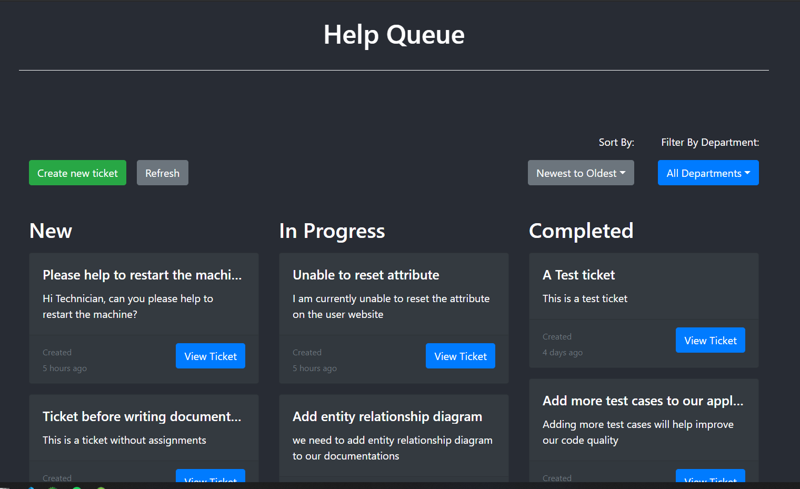

Written below are the detailed documentation for the help queue application.

---

## Table of Contents

<!-- TOC -->

- [Help Queue Documentation](#help-queue-documentation)
    - [Table of Contents](#table-of-contents)
    - [Project Submission Documents](#project-submission-documents)
        - [**Links to GitHub repositories**](#links-to-github-repositories)
        - [**Link to JIRA Board**](#link-to-jira-board)
        - [**Link to Submission Video**](#link-to-submission-video)
    - [Project Planning & Management](#project-planning--management)
        - [**JIRA Board**](#jira-board)
        - [**Entity Relationship Diagram**](#entity-relationship-diagram)
        - [**Wireframe Diagrams**](#wireframe-diagrams)
        - [**Sequence Diagrams**](#sequence-diagrams)
        - [**Risk Assessment Matrix**](#risk-assessment-matrix)
    - [Technical Documentation](#technical-documentation)
        - [**Features Implemented**](#features-implemented)
            - [_Basic Functionality (MVP)_](#_basic-functionality-mvp_)
            - [_Solutions_](#_solutions_)
            - [_Departments_](#_departments_)
            - [_Assignment_](#_assignment_)
            - [_Filtering_](#_filtering_)
        - [**Test Coverage**](#test-coverage)
            - [Front End React](#front-end-react)
            - [Back End Spring](#back-end-spring)

<!-- /TOC -->

## Project Submission Documents

### **Links to GitHub repositories**

Below are the links to the GitHub repositories related to this project:

-   help-queue-react (Frontend) - https://github.com/zckoh/help-queue-react
-   help-queue-spring (Backend) - https://github.com/zckoh/help-queue-spring
-   help-queue-devops (DevOps) - https://github.com/zckoh/help-queue-devops
-   help-queue-docs (Documentation) - https://github.com/zckoh/help-queue-docs

### **Link to JIRA Board**

Invite Link to JIRA Board - https://id.atlassian.com/invite/p/jira-software?id=WFqfsp5EQpyvFdZqJQq46g

### **Link to Submission Video**

Link to Submission Video - https://youtu.be/sbkvTW9UtgQ

## Project Planning & Management

Project planning is initially done prior to actual project development to help scope out the project and to help us to manage project, ensuring we will be able to deliver the application on time.

---

### **JIRA Board**

To help us with project planning, we are using JIRA as our project management tool where we can create new User Stories / Tasks / Issues to help us keep track on our work progress.

---

### **Entity Relationship Diagram**

An initial Entity Relationship Diagram (ERD) is created to help with the design / schema creation for the database. The initial ERD only consist of 1 table but it was later expanded for implementing additional features such as department / ticket assignment.
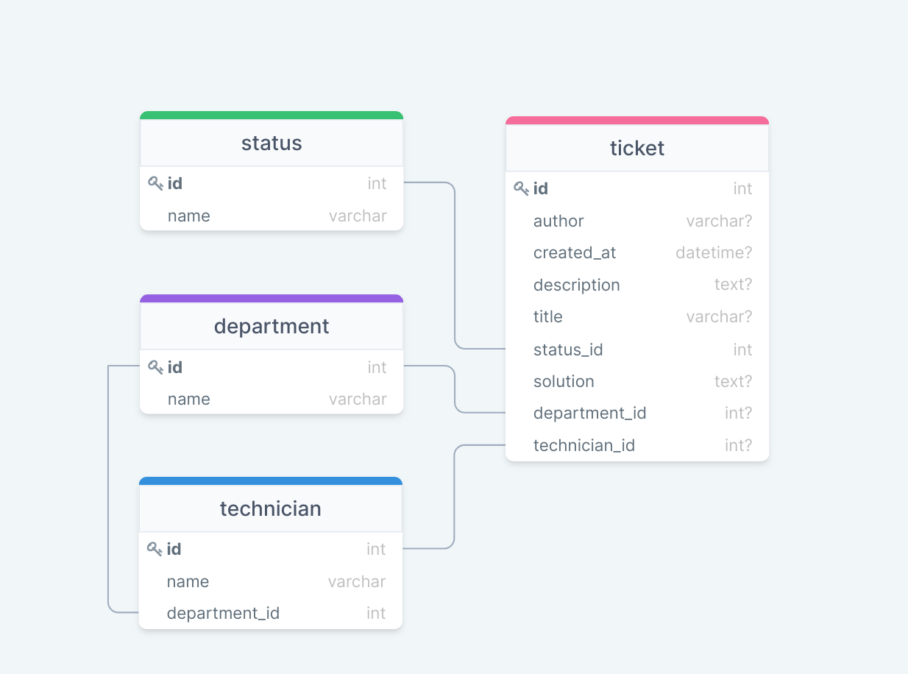

---

### **Wireframe Diagrams**

Wireframe diagrams were created at the start of the project to provide developer with a basic diagram to start with, which was very useful later during development as most of the design work was already completed when preparing the wireframe diagram.

<details>
<summary>Main Ticket Page / Landing Page</summary>
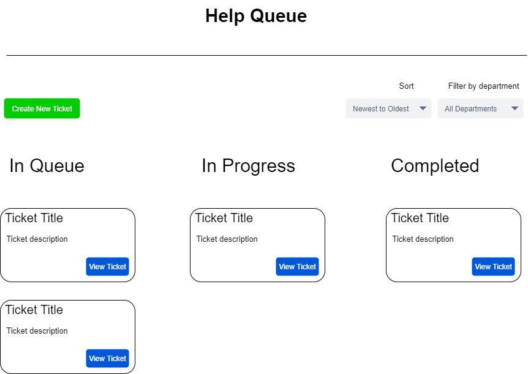
</details>

<details>
<summary>Create Ticket Modal</summary>
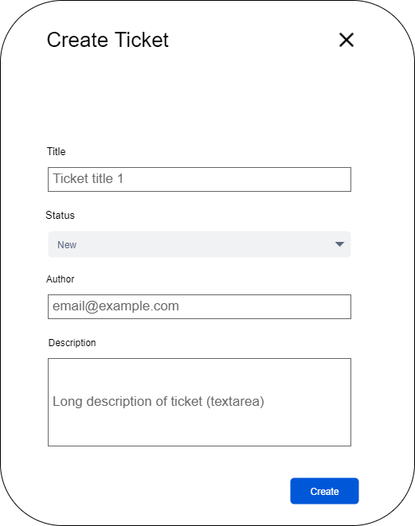
</details>

<details>
<summary>View / Update Ticket Modal</summary>
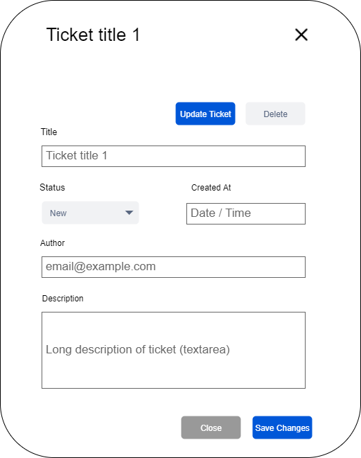
</details>

<details>
<summary>Delete Ticket Modal</summary>
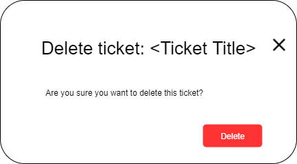
</details>

---

### **Sequence Diagrams**

<details>
<summary>Main Tickets Page / Landing Page</summary>
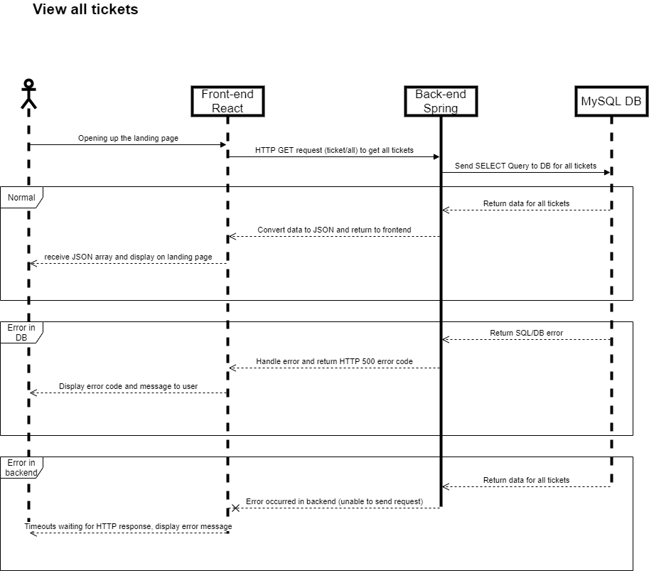
</details>

<details>
<summary>Create Ticket</summary>
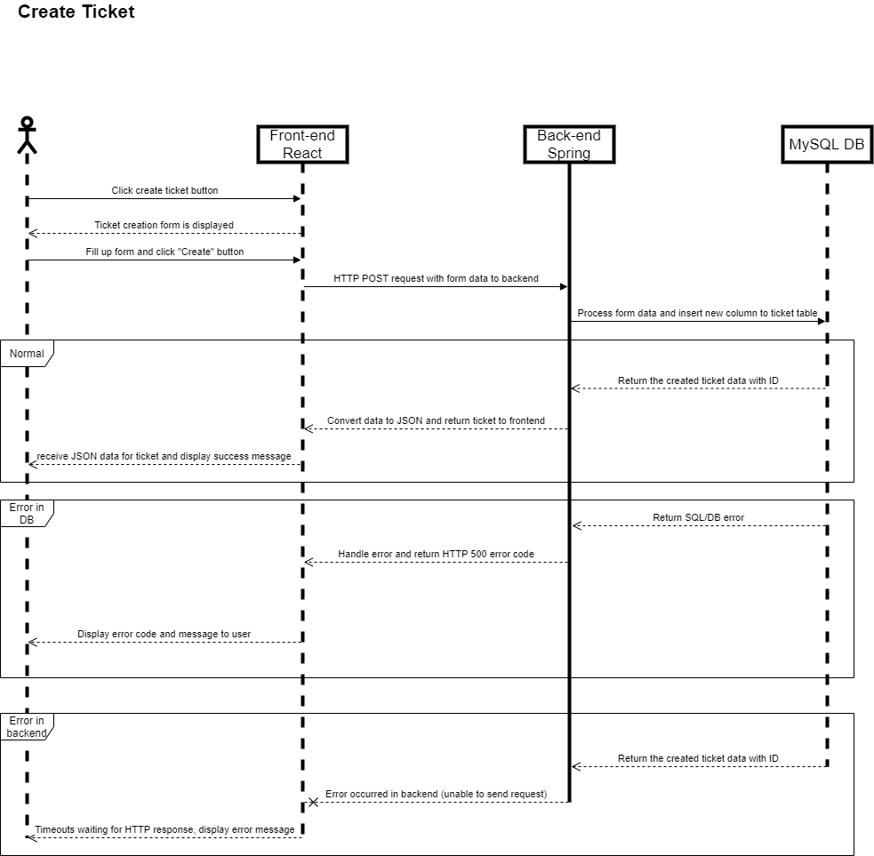
</details>

<details>
<summary>Update Ticket</summary>
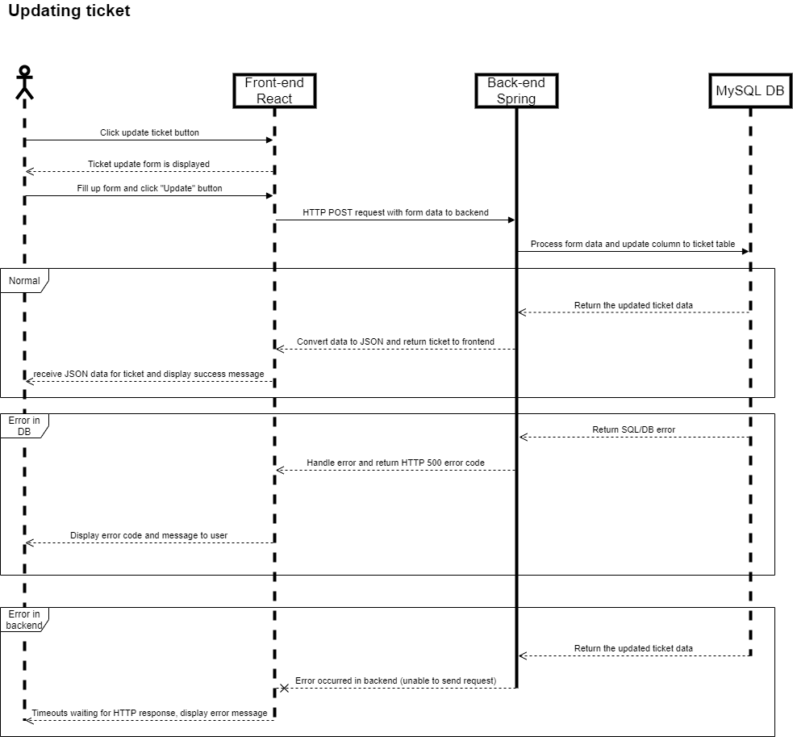
</details>

<details>
<summary>Delete Ticket</summary>
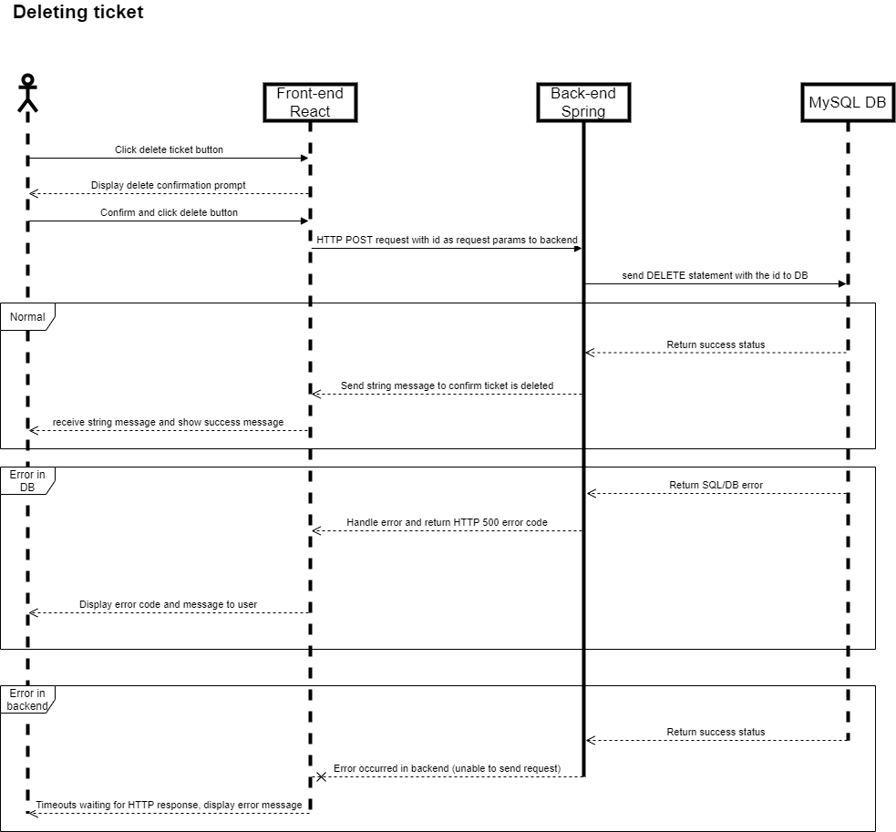
</details>

---

### **Risk Assessment Matrix**

| Description                                    | Evaluation                                                                                                                               | Likelihood | Impact    | Responsibility  | Response                                                                      | Control Measure                                                                                           |
| ---------------------------------------------- | ---------------------------------------------------------------------------------------------------------------------------------------- | ---------- | --------- | --------------- | ----------------------------------------------------------------------------- | --------------------------------------------------------------------------------------------------------- |
| Source code for application lost               | The developer's machine broke, <br>and the source code is only store on that machine                                                     | Medium     | Very High | Developer       | Ensure backups are stored elsewhere can easily be recovered                   | Mitigate <br>L - Use a version control system like GitHub to store our code                               |
| Unauthorized access to source code             | Malicious attacker that have access to the source code can <br>find vulnerabilities in our application and try to break our application. | Low        | Very High | Developer       | Ensure our code base is only accessible to the application team               | Mitigate<br>L - Make the code repository private and only allow access to application developer           |
| Unauthorized access to database                | Delete all records / steal personal data                                                                                                 | Low        | Very High | AWS / Developer | Try to recover as much data as possible. Identify/fix vulnerability           | Mitigate<br>L - Ensure strong password used for database connection. Backup in RDS                        |
| Database storage full                          | User unable to create new tickets                                                                                                        | Low        | High      | Developer       | Try to increase the storage capacity of the database                          | Mitigate<br>L - When initially setting up the database, provide a decent amount of storage                |
| Server down unable to serve application        | Users unable to access the webapp.                                                                                                       | Very Low   | High      | AWS             | Identify / check which resource is affected and try to restore service        | Accept<br>Accept the risk that AWS could be potentially down but it is very unlikely                      |
| Human error in deployment steps for production | Error in deployment cause deployment to fail/unsuccessful                                                                                | Medium     | High      | Developer       | Identify / review steps taken and correct the mistake made during deployment. | Mitigate<br>L - Use CI pipeline to automate deployment step, preventing any human error during deployment |

---

## Technical Documentation

This sections covers all the technical aspects of the project.

When the back-end Java Spring Boot application is started, it should automatically help to create the database schemas based on the Entities listed in the Spring project.

Before creating tickets, we will need to add the following entites in the following order:

1. Status
   To add a new status, we can send a HTTP POST request to the `/status/add` endpoint with the following JSON body:

    ```JSON
    {
        "name": "Status Name"
    }
    ```

2. Department
   To add a new technician, we can send a HTTP POST request to the `/technician/add` endpoint with the following JSON body:

    ```JSON
    {
        "name": "Department Name"
    }
    ```

3. Technician
   To add a new department, we can send a HTTP POST request to the `/department/add` endpoint with the following JSON body:

    ```JSON
    {
        "name": "Technician Name",
        "department": {
            "id": 1,
            "name": "Department Name"
        }
    }
    ```

Once the above entities have been created, we can then proceed to allow users to add / update /delete tickets.

---

### **Features Implemented**

#### _Basic Functionality (MVP)_

The basic CRUD functionality have been implemented.

Users will be able to:

-   Create new tickets and add them to the queue
-   View tickets in the current queue from oldest to newest
-   Delete existing tickets in the queue
-   Update existing tickets in the queue

#### _Solutions_

Once a ticket is marked as "Completed", Users should be able to add a solution to that ticket, allowing other users to see the solutions to a problem that has already been solved.

#### _Departments_

Users can assign a ticket to a department, and technicians can use the "Filter By Department" filtering option to see help queue specific to their expertise.

#### _Assignment_

Users can assign a ticket to a technician. When creating/updating the ticket, the available technician options provided is based on the department the ticket is currently assigned to.

#### _Filtering_

Users can filter/arrange tickets based on attributes such as:

-   Newest to Oldest
-   Oldest to Newest
-   Filter by Department

---

### **Test Coverage**

#### Front End React

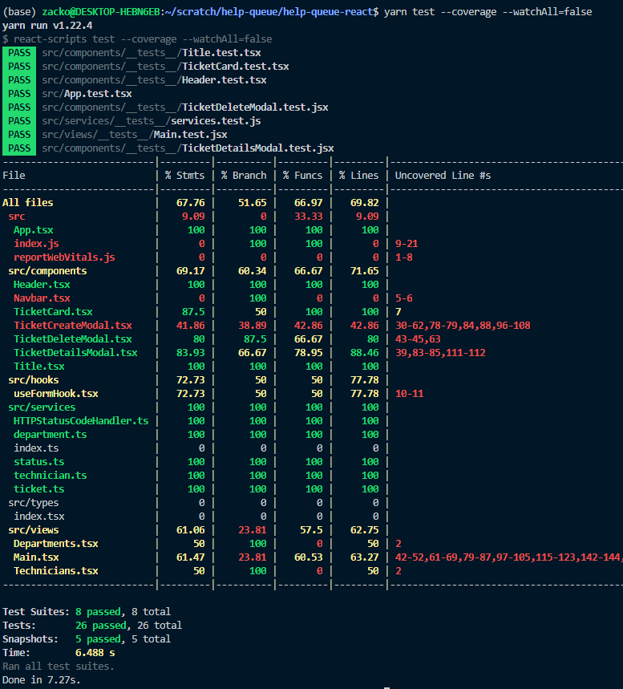

#### Back End Spring

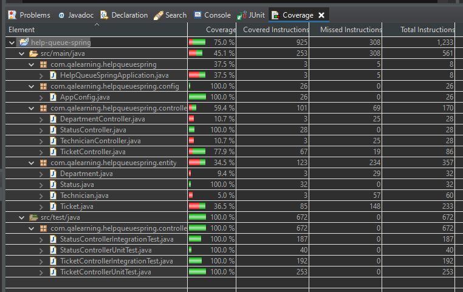
